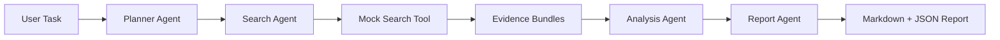

# Multi-Agent Workflow

Multi-Agent Workflow 是我用来展示 Agent Workflow 工程能力的项目。我没有把它做成简单的“多个 Agent 类互相调用”，而是把任务规划、工具检索、证据分析和报告生成拆成清晰的工作流，让每一步都有输入输出、执行轨迹和可解释结果。

项目默认不依赖真实联网搜索或 API Key。Search Agent 使用本地 mock search tool，但工具接口、结果评分、证据引用和调用日志都按真实工具接入的方式设计，后续可以替换成搜索 API、向量数据库或真实 LLM。

## 我实现了什么

- Planner Agent：识别任务意图，拆解研究步骤，生成查询策略和成功标准
- Search Agent：调用 mock search tool，返回带相关性评分的证据结果
- Analysis Agent：聚合证据，生成 finding，计算置信度，标记风险和信息缺口
- Report Agent：输出 Markdown 报告和结构化 JSON，方便 CLI、API 和前端复用
- Workflow Orchestrator：统一调度 Agent 状态流转，并保留完整 tool trace

## 项目亮点

- 任务不是一次性问答，而是被拆成可执行步骤
- 每个结论尽量绑定证据来源和 confidence score
- mock search tool 返回 source_id、score、tags 和 content
- 报告包含 recommendations、risks、limitations 和 tool trace
- 同时支持 CLI 和 FastAPI，方便本地演示和接口调用

## 技术栈

- Python 3.10+
- FastAPI
- Pydantic
- Uvicorn
- Pytest

## 项目结构

```text
multi-agent-workflow/
├── app/
│   ├── agents/
│   │   ├── analysis_agent.py
│   │   ├── base.py
│   │   ├── planner_agent.py
│   │   ├── report_agent.py
│   │   └── search_agent.py
│   ├── core/
│   │   └── workflow.py
│   ├── data/
│   │   └── search_corpus.py
│   ├── models/
│   │   └── schemas.py
│   ├── tools/
│   │   └── mock_search.py
│   └── main.py
├── examples/
│   └── sample_task.txt
├── reports/
│   └── .gitkeep
├── scripts/
│   └── run_workflow.py
├── tests/
│   └── test_workflow.py
├── requirements.txt
└── README.md
```

## 快速开始

### 1. 创建虚拟环境

Windows PowerShell:

```powershell
python -m venv .venv
.\.venv\Scripts\Activate.ps1
```

macOS / Linux:

```bash
python -m venv .venv
source .venv/bin/activate
```

### 2. 安装依赖

```bash
pip install -r requirements.txt
```

### 3. 运行命令行 Demo

```bash
python scripts/run_workflow.py --task "分析一个 AI Agent 项目如何体现工程深度" --depth deep
```

输出 Markdown 报告：

```bash
python scripts/run_workflow.py --task "设计一个 RAG 知识库问答系统的技术方案" --output reports/rag-workflow.md
```

输出 JSON：

```bash
python scripts/run_workflow.py --task "评估一个多智能体项目的工程亮点" --json
```

### 4. 启动 API 服务

```bash
uvicorn app.main:app --reload
```

访问：

- API 首页：http://127.0.0.1:8000
- Swagger 文档：http://127.0.0.1:8000/docs
- 健康检查：http://127.0.0.1:8000/health

## API 示例

```bash
curl -X POST http://127.0.0.1:8000/workflow/run \
  -H "Content-Type: application/json" \
  -d '{
    "task": "分析一个 AI Agent 项目如何体现工程深度",
    "audience": "AI internship interviewer",
    "depth": "deep",
    "max_search_results": 4
  }'
```

## Workflow 设计



## 示例输出片段

```markdown
# Multi-Agent Analysis Report

## Executive Summary
- Task: 分析一个 AI Agent 项目如何体现工程深度
- Intent: `agent_workflow`
- Planned steps: 5
- Tool calls: 15

## Key Findings
### 1. Agent workflow needs explicit orchestration and tool contracts
- Confidence: `0.94`
- Evidence: SRC-001, SRC-003, SRC-002
```

## 我想展示的工程点

- Agent 拆分要服务于状态流转，而不是只按名称拆类
- Tool Calling 需要稳定的输入输出 schema 和调用日志
- 检索结果需要 score 和 source_id，方便解释结论来源
- Analysis 阶段需要 confidence 和 limitation，避免输出过度确定的结论
- Report 阶段要同时服务人类阅读和 API/前端复用

## 对外介绍

我实现了一个多智能体任务分析系统，包含 Planner、Search、Analysis、Report 四类 Agent。系统支持任务拆解、mock 工具检索、证据评分、置信度分析和结构化报告生成，并提供 CLI 与 FastAPI 两种运行方式。这个项目主要展示我对 Agent Workflow 编排、Tool Calling 抽象和可解释 AI 应用开发的理解。

## 后续计划

- 将 mock search tool 替换为真实搜索 API 或向量数据库
- 接入真实 LLM，由 Planner 动态生成任务树和工具调用计划
- 增加 workflow memory，把历史任务结果作为上下文
- 增加评估模块，统计报告完整性、证据覆盖率和任务完成度
- 增加前端页面，用时间线展示多 Agent 协作过程
