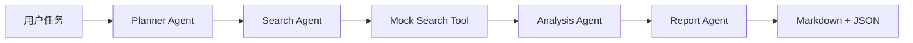

# Multi-Agent Workflow

这是我实现的一个多智能体研究工作流。用户提交任务后，系统依次完成任务规划、资料检索、证据分析和报告生成，最终返回 Markdown 报告与结构化 JSON。

我把它做成工作流而不是多轮角色对话：每个 Agent 都有明确的输入输出，工具调用会留下记录，分析结论也会关联证据来源。项目使用本地检索语料，因此不联网、不配置 API Key 也能运行。

## 工作流程



### Planner Agent

识别任务类型，生成研究步骤、检索词和完成标准。不同 `depth` 会影响任务拆解的数量。

### Search Agent

按照计划调用检索工具，返回带来源编号和相关性分数的结果，并记录每次工具调用。

### Analysis Agent

去重并汇总证据，生成主要发现、风险、建议和置信度。证据不足时会在 `limitations` 中明确说明。

### Report Agent

把工作流结果整理为适合阅读的 Markdown，同时保留 JSON 字段供 API 或前端使用。

## 为什么保留本地检索

当前版本的重点是验证 Agent 之间的状态传递和工具契约，而不是搜索服务本身。`MockSearchTool` 与 Agent 解耦，之后接入搜索 API、向量数据库或内部知识库时，只需要保持相同的返回结构。

## 技术栈

- Python 3.10+
- FastAPI
- Pydantic
- Uvicorn
- Pytest

## 项目结构

```text
multi-agent-workflow/
├── app/
│   ├── agents/          # Planner、Search、Analysis、Report
│   ├── core/workflow.py # 工作流编排
│   ├── data/            # 本地检索语料
│   ├── models/          # 工作流状态与报告模型
│   ├── tools/           # 检索工具
│   └── main.py
├── examples/
├── reports/
├── scripts/run_workflow.py
├── tests/test_workflow.py
└── requirements.txt
```

## 本地运行

```bash
python -m venv .venv
```

Windows PowerShell:

```powershell
.\.venv\Scripts\Activate.ps1
pip install -r requirements.txt
python scripts/run_workflow.py --task "分析一个 AI Agent 项目如何体现工程深度" --depth deep
```

macOS / Linux:

```bash
source .venv/bin/activate
pip install -r requirements.txt
python scripts/run_workflow.py --task "分析一个 AI Agent 项目如何体现工程深度" --depth deep
```

保存 Markdown 报告：

```bash
python scripts/run_workflow.py \
  --task "设计一个 RAG 知识库问答系统的技术方案" \
  --output reports/rag-workflow.md
```

输出完整 JSON：

```bash
python scripts/run_workflow.py \
  --task "评估一个多智能体项目的工程亮点" \
  --json
```

## API

```bash
uvicorn app.main:app --reload
```

- Swagger：<http://127.0.0.1:8000/docs>
- 健康检查：<http://127.0.0.1:8000/health>

调用工作流：

```bash
curl -X POST http://127.0.0.1:8000/workflow/run \
  -H "Content-Type: application/json" \
  -d '{
    "task": "分析一个 AI Agent 项目如何体现工程深度",
    "audience": "AI internship interviewer",
    "depth": "deep",
    "max_search_results": 4
  }'
```

## 输出内容

一次完整运行会返回：

- 原始任务与任务规划
- 各步骤检索到的证据
- 工具调用记录
- 带置信度的分析结论
- 风险、建议和信息限制
- Markdown 报告

## 当前范围

这个版本使用固定的本地语料，Planner 和分析逻辑也是确定性的，便于测试和复现。它还不是一个依赖真实 LLM 自主决策的生产级 Agent 系统。
